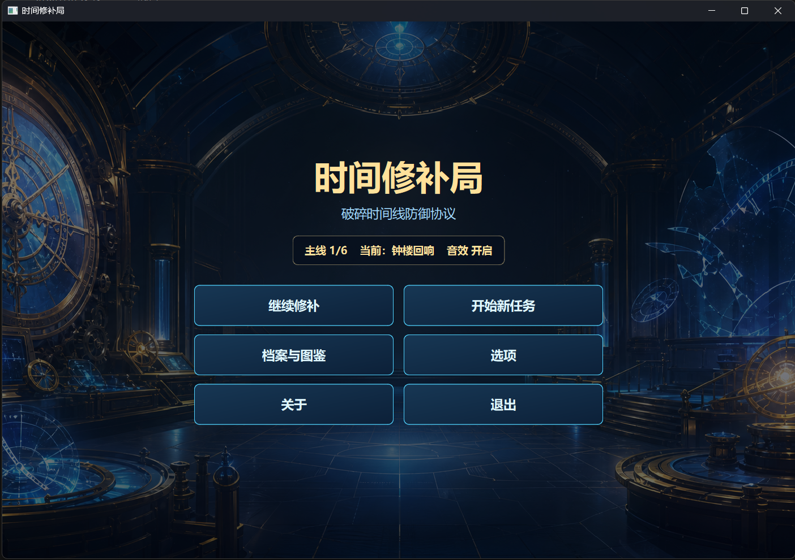
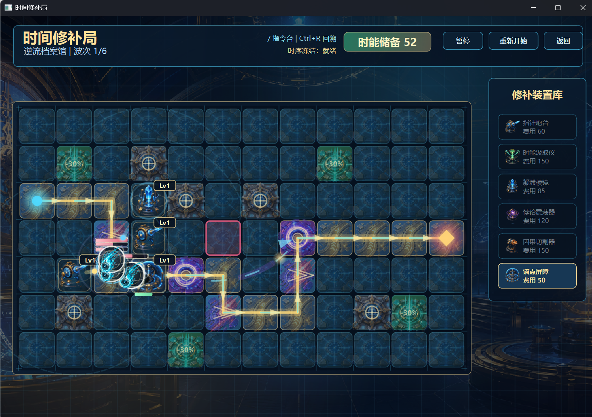
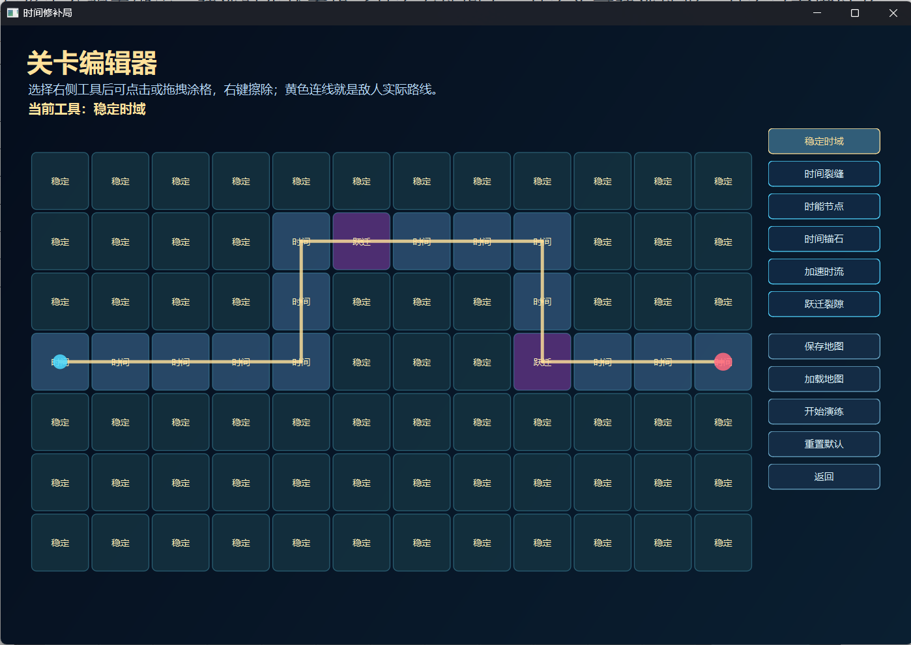
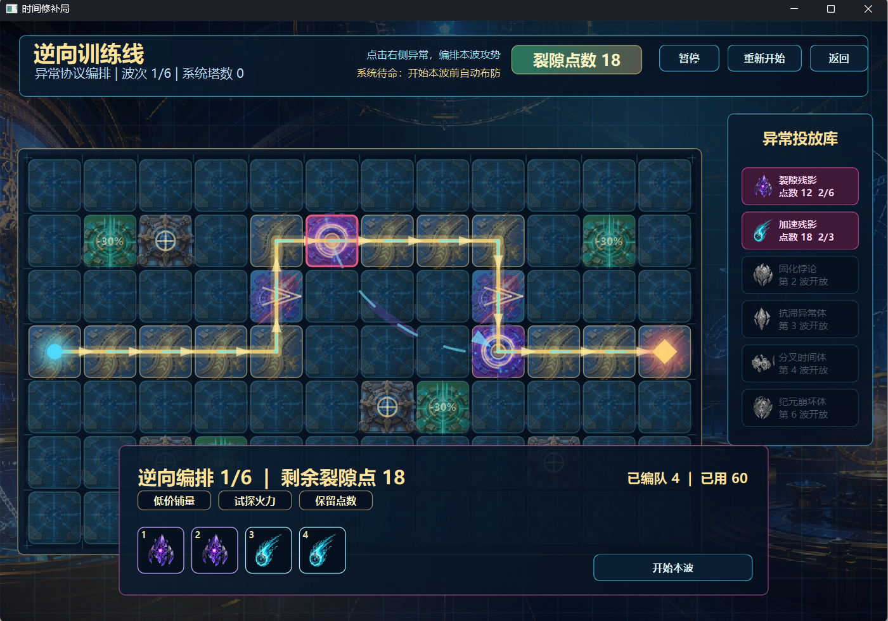

[English](README.md) | [简体中文](README.zh-CN.md)

# 时间修补局 · Time Repair Bureau

使用 C++17 和 Qt Widgets 开发的剧情驱动二维网格塔防游戏。玩家在受损时间线上部署防御装置，阻止异常体抵达时间核心。

## 功能

- 六个主线关卡与各关独立 Boss。
- 六类防御塔、六类敌人、地形效果、资源、升级与主动技能。
- 剧情通讯、暂停式教学、档案与图鉴。
- JSON 数值配置，以及进度和设置保存。
- 支持保存、加载和直接演练的自定义关卡编辑器。
- 三个逆向推演关卡：由玩家编排敌人，系统部署防御塔。
- AI 辅助美术与可选的 WAV 音效和音乐。

## 游戏展示

### 主界面

继续当前时间线、开始新任务，或进入档案与设置。

### 塔防战斗

围绕地形与传送路线部署、升级防御装置，阻止异常体突破时间核心。

### 关卡编辑器

绘制地形和路线，保存、加载地图，并直接开始演练。

### 逆向推演

在点数预算内编排敌人队列，挑战系统自动部署的防线。

## 构建与运行

在 Qt Creator 中打开 `src/TimeRepairBureau.pro`，选择支持 C++17 的 Qt 6 Desktop Kit。项目面向 Windows，参考环境为 Qt 6.5.3 MinGW 64-bit。

构建后，将 `src/assets/` 与 `src/config/` 放到可执行文件同级，目录名保持为 `assets/` 和 `config/`。命令行构建方法见 [编译运行说明](doc/编译运行说明.md)。

WAV 资源放置在 `src/assets/sfx/`，文件与部署方式见 [音频资源说明](src/assets/sfx/README.zh-CN.md)。缺少音频时，对应声音静音。

## 项目结构

- `src/`：应用源码与 qmake 工程。
- `src/config/`：防御塔配置。
- `src/assets/ai/`：背景、精灵图与角色美术。
- `src/assets/sfx/`：音频资源目录。
- `doc/`：构建说明与开发文档。

## 开发与素材

参见 [AI 开发声明](doc/AI工具使用声明.md) 和 [素材说明](doc/素材来源.md)。
